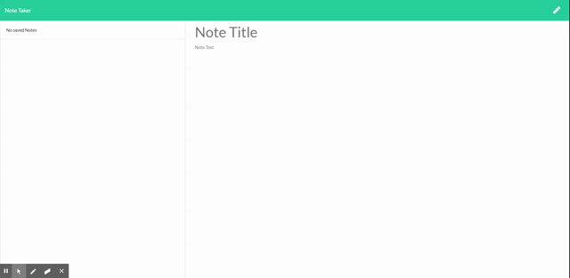

# note-taker

## Description

 *  The user is presented with a landing page with a link to the notes page

 *  On the notes page, the user can enter a new note title, and it's test. A save icon will appear, allowing the user to save that information

 *  Once the information appears, the saved note will appear alongside other saved notes on the left hand side of the page

 *  The user can view the saved note by clicking on the existing note on the left hand side of the page

 *  The user can create a new note by clicking on the write icon on the top of the page

 *  The user can delete an existing note by clicking the trash icon to the right of the note the user wishes to delete.

 *  Link to Github Repository: (https://github.com/jnunez1229/note-taker)
  
  *  Link to Deployed Site: (https://infinite-badlands-64590.herokuapp.com/)

## Use

